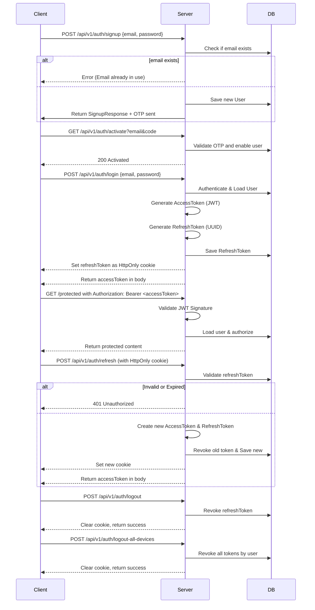

# ToDo-Spring-Microservices-Jwt
 ToDo App built using a microservices architecture
 ## Sequence Diagram 

```mermaid
sequenceDiagram
    participant Client
    participant Server
    participant DB

    %% Signup
    Client->>Server: POST /api/v1/auth/signup {email, password}
    Server->>DB: Check if email exists
    alt email exists
        Server-->>Client: Error (Email already in use)
    else
        Server->>DB: Save new User
        Server->>Client: Return SignupResponse + OTP sent
    end

    %% Activate
    Client->>Server: GET /api/v1/auth/activate?email&code
    Server->>DB: Validate OTP and enable user
    Server-->>Client: 200 Activated

    %% Login
    Client->>Server: POST /api/v1/auth/login {email, password}
    Server->>DB: Authenticate & Load User
    Server->>Server: Generate AccessToken (JWT)
    Server->>Server: Generate RefreshToken (UUID)
    Server->>DB: Save RefreshToken
    Server-->>Client: Set refreshToken as HttpOnly cookie
    Server-->>Client: Return accessToken in body

    %% Access Protected Route
    Client->>Server: GET /protected with Authorization: Bearer <accessToken>
    Server->>Server: Validate JWT Signature
    Server->>DB: Load user & authorize
    Server-->>Client: Return protected content

    %% Refresh Access Token
    Client->>Server: POST /api/v1/auth/refresh (with HttpOnly cookie)
    Server->>DB: Validate refreshToken
    alt Invalid or Expired
        Server-->>Client: 401 Unauthorized
    else
        Server->>Server: Create new AccessToken & RefreshToken
        Server->>DB: Revoke old token & Save new
        Server-->>Client: Set new cookie
        Server-->>Client: Return accessToken in body
    end

    %% Logout
    Client->>Server: POST /api/v1/auth/logout
    Server->>DB: Revoke refreshToken
    Server-->>Client: Clear cookie, return success

    %% Logout All Devices
    Client->>Server: POST /api/v1/auth/logout-all-devices
    Server->>DB: Revoke all tokens by user
    Server-->>Client: Clear cookie, return success

```
