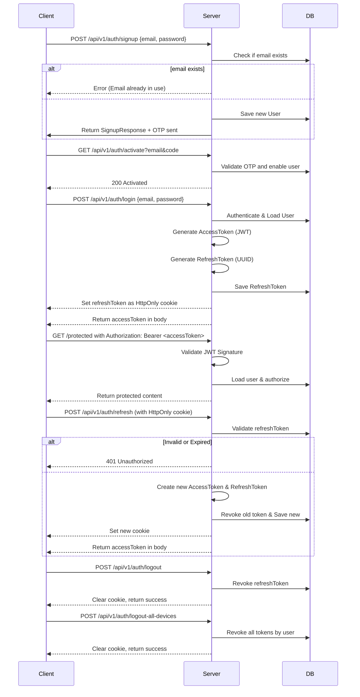

# ToDo-Spring-Microservices-Jwt
 

 ### AuthService 

This service is a secure authentication system built with **Spring Boot**, implementing robust best practices using:

- **JWT access tokens**
- **Refresh tokens (rotating + stored in DB)**
- **HttpOnly cookies**
- **Device fingerprinting (IP + User-Agent)**
- **Session lifecycle management**
- **OTP-based email verification**

### Secuence Diagram 
The diagram shows flow of how we implement User Registration, User Login and Authorization process.
 ## Sequence Diagram 

### Features

- User Registration with OTP verification
- Secure Login with email & password
- JWT Access Token (short-lived)
- Refresh Token (long-lived, HttpOnly, revoked on use)
- Revoke refresh token on logout
- Logout from all devices
- if a revoked refresh token is reused, all tokens should be deleted and the user logged out.
- Token rotation on refresh
- Session expiration control (30-day max session)
- Device & IP validation
- CSRF protection by avoiding exposing refresh tokens to JavaScript

### core Technologies

- Spring Boot 3
- Spring Security
- Spring data (JPA)
- JWT (io.jsonwebtoken)
- Lombok
- Maven
- MySql
- RESTful APIs
- Java 17
- Java Mail Sender (OTP)

### API Documentation

| Endpoint                     | Method | Description                          |
|-----------------------------|--------|--------------------------------------|
| `/api/v1/auth/signup`       | POST   | Register user with email & password |
| `/api/v1/auth/activate`     | GET    | Verify OTP and activate user        |
| `/api/v1/auth/login`        | POST   | Login and receive access + refresh token |
| `/api/v1/auth/refresh`      | POST   | Get new access token using HttpOnly refresh cookie |
| `/api/v1/auth/logout`       | POST   | Logout (revokes token, clears cookie) |
| `/api/v1/auth/logout-all-devices` | POST | Logout from all sessions/devices |
| `/api/v1/auth/checkToken`   | GET    | Validate access token and return user info |

